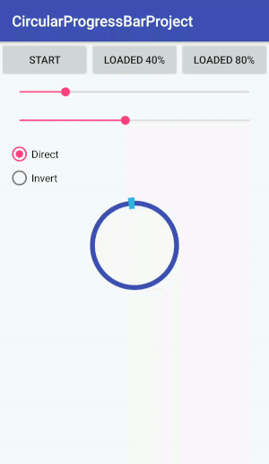

# CircularProgressBar

[  ](https://bintray.com/riningan/AndroidMaven/CircularProgressBar/_latestVersion)

Android circlular progress bat with two state: loading and show value

DEMO
---



USAGE
---

Using CircularProgressBar in your application.
Add dependencies in build.gradle of your module.

```groovy
	dependencies {
		compile 'com.riningan.widget:circularprogressbar:1.0'
	}
```

XML
-----

```xml
<com.riningan.widget.CircularProgressBar
    android:id="@+id/circularProgressBar"
    android:layout_width="128dp"
    android:layout_height="128dp"
    app:cpb_background_color="@color/colorPrimary"
    app:cpb_background_width="15dp"
    app:cpb_progress_color="@android:color/holo_blue_light"
    app:cpb_progress_value="50"
    app:cpb_progress_width="20dp"
    app:cpb_state="progress_direct" />
```
All properties from Google BottomSheetBehavior including same new:

* `app:cpb_background_color`     (color)       -> default GRAY
* `app:cpb_progress_color`       (color)       -> default BLACK
* `app:cpb_background_width`     (dimension)   -> default @dimen/default_cpb_background_width
* `app:cpb_progress_width`       (dimension)   -> default @dimen/default_cpb_progress_width
* `app:cpb_progress_value`       (integer)     -> default 0
* `app:cpb_state`                (enum)        -> default loading

```xml
<attr name="cpb_state" format="enum" >
    <enum name="loading" value="1"/>
    <enum name="progress_direct" value="2"/>
    <enum name="progress_invert" value="3"/>
</attr>
```

JAVA
-----

```java
CircularProgressBar mCircularProgressBar = (CircularProgressBar) findViewById(R.id.circularProgressBar);
mCircularProgressBar.setState(CircularProgressBar.StateEnum state);
mCircularProgressBar.setProgressWidth(float progressWidth);
mCircularProgressBar.setBackgroundWidth(float backgroundWidth);
mCircularProgressBar.setProgressColor(@ColorInt int progressColor);
mCircularProgressBar.setBackgroundColor(@ColorInt int backgroundColor);
mCircularProgressBar.setProgress(float progress);
mCircularProgressBar.setProgressWithAnimation(float progress);
mCircularProgressBar.setProgressWithAnimation(float progress, StateEnum state);
mCircularProgressBar.setProgressWithAnimation(float progress, int duration);       
mCircularProgressBar.setProgressWithAnimation(float progress, int duration, StateEnum state);
```
"progress" value between 0 and 100

default "state" value is StateEnum.ProgressDirect

default "duration" value is 1500 ms

```java
public enum StateEnum {
    Loading, ProgressDirect, ProgressInvert
}
```

LICENCE
-----

  	Licensed under the Apache License, Version 2.0 (the "License");
	you may not use this file except in compliance with the License.
	You may obtain a copy of the License at
	
	   http://www.apache.org/licenses/LICENSE-2.0
	
	Unless required by applicable law or agreed to in writing, software
	distributed under the License is distributed on an "AS IS" BASIS,
	WITHOUT WARRANTIES OR CONDITIONS OF ANY KIND, either express or implied.
	See the License for the specific language governing permissions and
	limitations under the License.
